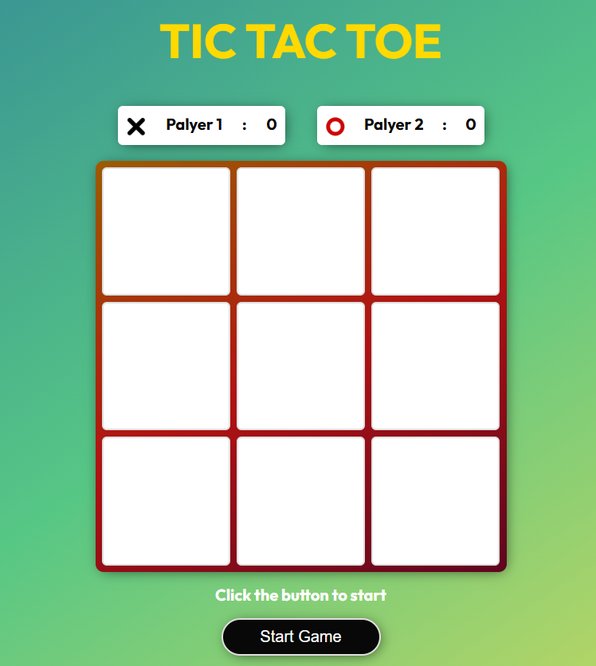

# 🎮 Tic Tac Toe  

An interactive **Tic Tac Toe** game built with **HTML**, **CSS**, and **JavaScript**, featuring player name input, score tracking, and automatic match reset.  

## 🌐 Live Demo  

🔗 **Play here:** [brunoaraujosoares.github.io/tic-tac-toe](https://brunoaraujosoares.github.io/tic-tac-toe/)  

## 📸 Preview  

*(Optional – add a screenshot here)*  
  

## 🚀 Features  

- ✅ **Responsive UI** with a clean, modern design  
- ✅ **Player name input** via modal dialog  
- ✅ **Score tracking** that persists through rounds  
- ✅ **Turn indicator** for active player  
- ✅ **Victory and tie detection**  
- ✅ **Automatic board reset** after 2 seconds  
- ✅ **Stylish design** with gradients, shadows, and animations  

## 🛠️ Tech Stack  

- **HTML5** – Page structure  
- **CSS3** – Styling (layout, gradients, modal animations)  
- **JavaScript** – Game logic, DOM manipulation, and event handling  

## 📂 Project Structure  

```bash
📁 tic-tac-toe/
 ┣ 📄 index.html        # Main page structure
 ┣ 📄 styles.css        # General styles (layout, typography, grid)
 ┣ 📄 modal.css         # Modal-specific styles and animations
 ┣ 📄 script.js         # Game logic (turns, win/tie check, reset)
 ┗ 📁 assets/           # "X" and "O" images for the board
